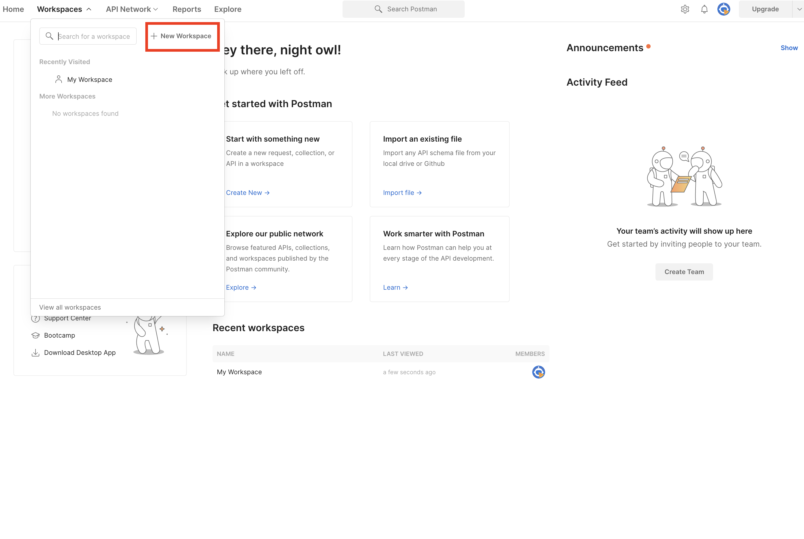

# APIs (Application Programming Interface)

**What is an API?**

***Application Programming Interface (API)*** is a software interface that allows two applications to interact with each other without any user intervention. API is a collection of software functions and procedures. In simple terms, API means a software code that can be accessed or executed. API is defined as a code that helps two different software’s to communicate and exchange data with each other.

**What is Web APIs?**

A Web API is an application programming interface which is use either for web server or a web browser. APIs come in many types and forms. Which one a developer chooses among a variety of API protocols and standards depends on the purpose. The common API types include:

**REST-based APIs:**
A data-driven architectural style of API development, REST (Representational State Transfer) is one of the most lucrative categories of web-based APIs. Based on Uniform Resource Identifiers (URIs) and HTTP protocol, REST-based APIs use JSON for data formatting which is considered to be browser-compatible.

REST-based APIs are extremely simple when it comes to building and scaling as compared to other types of APIs. When these types of APIs are put to action, they help facilitate client-server communications with ease and smoothness. Because REST-based APIs are simple, they can be the perfect APIs for beginners.

**SOAP-based APIs:**
As compared to its peers, SOAP-based APIs (Simple Object Access Protocol) can be viewed as quite complex in terms of use. These APIs use a type of protocol known as Simple Object Access Protocol, which is a common communication protocol. This helps them in providing higher levels of security and makes them better at accuracy as compared with the REST-based APIs in the way messages are exchanged.

**GraphQL-based APIs:**
GraphQL is one of the most advanced sets of web-based APIs where open-source data query and manipulation language is used. This makes it easier for forming a definitive pathway for the runtime that plays a vital role in fulfilling queries with the pre-existing data.

Although it is well known that GraphQL and REST APIs both use the same set of APIs, the major thing that differentiates them is the interface: a single interface-id is put to use by GraphQL when it comes to organizing data into the format of a graph.

**XML-RPC:**
XML-RPC (Extensible Markup Language-Remote Procedure Call) can be described as another type of API protocol, which differentiates itself in terms of information security and the use of XML format that is specifically designed for transferring data. When compared to SOAP-based APIs, the XML-RPC protocols are easier and much simpler to use since they use minimum bandwidth.

Examples of web API:

* Google Maps API’s allow developers to embed Google Maps on webpages by using a JavaScript or Flash interface.
* YouTube API allows developers to integrate YouTube videos and functionality into websites or applications.
* Twitter offers two APIs. The REST API helps developers to access Twitter data, and the search API provides methods for developers to interact with Twitter Search.
* Amazon’s API gives developers access to Amazon’s product selection.

**What is REST?**

REST is an architecture consisting of best practices and patterns for web development. It is a set of guidelines for developers rather than a true protocol. Websites and applications are considered RESTful if they follow REST principles. REST is now the industry-standard model for client-server interactions on the web, and most popular web services are only accessible through REST interfaces. The most important REST guidelines are as follows:

* **Client-server Architecture:** Clients and servers are loosely coupled and communicate via an API.
* **Statelessness:** Requests are independent and do not rely on the current state of the transaction.
* **Caches:** Caches are used for better performance and increased security.
* **Layering:** Additional features, such as security protocols, can be added to REST as a separate layer. For example, the user can be authenticated and then the request can be passed to another layer for processing.
* **Uniform interfaces:** Clients use well-known ***Uniform Resource Indicator (URIs)*** to request information. They must identify the specific resource to access and the format to use. The services are not customizable, so clients must use the official generic interface.

REST principles are straightforward. Clients use a Uniform Resource Identifier (URI) to request information from a server. Inside the message, which is typically sent using HTTP, the client identifies the resources it wants. It can also specify a format for the reply. The server replies with the requested data, in ***JavaScript Object Notation (JSON)***, HTML, or XML. A REST request includes the following components:

* An HTTP method indicating the requested operation, such as `GET` or `PUT`.
* A header, including the media type the sender wants to receive. Some examples are `text/css` and `image/gif`.
* The URI to the resource, including any optional parameters. A client can specify the URI using the formats `example.com/products/137` or `example.com/products/:id`.

The REST architecture is an industry standard because it offers many advantages. Some of its advantages are as follows:

* It is scalable, fast, robust, and efficient. REST APIs do not use much bandwidth.
* It is easy to understand and implement.
* It promotes modular architecture and good design.
* Clients and servers are fully decoupled. It is easier to make changes to the API or the internal design and is more secure.
* It allows many different message formats.

However, REST cannot process any requests based on the state of the transaction. It also does not guarantee reliability or include any security features. Client applications must implement these features.

**What are RESTful Verbs?**

REST interfaces allow for a fixed set of interactions. Taken together, these operations are known as the *RESTful verbs* or *REST verbs.* Each RESTful verb indicates an action on the client-side application.

Each distinct operation is associated with a specific RESTFul verb and a range of possible status codes. A client like postman or curl must include a RESTful verb inside the HTTP header for each request. The RESTful verbs correspond to the main create, read, update, and delete (CRUD) database operations.

Here are the main RESTful verbs that allow clients to use a REST API:

* **POST**: This RESTful verb creates a new resource on the server. If successful, the `POST` action returns code `201` for “Created” and provides a link to the new reference. Failure codes include `404` for “Not Found”, or a `409` conflict error if the item already exists.
* **GET**: `GET` is used to retrieve information from the server. It can read an entire list or one specific item, and returns code `200` for “OK” if successful. If the item or collection cannot be found, the server returns code `404`.
* **PUT**: The `PUT` REST verb is used to update a specific item. The client must specify all attributes for the item. This method returns the status code `200` when the item is updated. The server returns either `404` for “Not Found” or `405` for “Method Not Allowed” if the update fails.
* **PATCH**: This REST verb is similar to `PUT`. It modifies the item, but only contains the new changes, not the entire item. However, this verb is not considered safe from collisions. It is not recommended and is not used very much.
* **DELETE**: The `DELETE` RESTful verb deletes an entry from the database, although it can also potentially delete the entire collection. It returns code `200` when successful, and code `404` or `405` otherwise.
* **OPTIONS**: This verb fetches a list of all available operations.

For almost all APIs, the `POST`, `PUT`, `PATCH`, and `DELETE` operations require server authentication. However, many servers allow anonymous `GET` operations for public data. If the server cannot authorize a user, it returns the failure code `401` for “Unauthorized”. Failure code `403`, or “Forbidden”, is used if the client is not allowed to access the resource.

## Testing APIs using Postman Client

**What is Postman?**

Postman is an API testing tool that allows you to perform comprehensive testing faster. It offers:

* a simple user interface where each integral part of the API lifecycle can be easily visualized and understood.
* pre-built code snippets that can be used for verifying tests or for generating test data used in tests.
* a wide range of options, for example, testing on different environments, testing on different servers, documentation of the API, collaboration and sharing the API with teammates or with the world.

**Postman Workspaces**

A Postman workspace is where you can organize your API and team up with others in your organization.

There are three kinds of workspaces in Postman:

1. Personal workspace, as the name suggests, is for personal usage.
2. Private workspace is only available to people who you invite to collaborate within the workspace. Then, you can organize it into folders and share it with your workspace members.
3. Public Workspaces allow you to share your APIs with the world. They are searchable and accessible for free.

Postman’s API testing features are available for Personal, Private, and Public workspaces.

**Creating a new workspace**

To create a new workspace, select Workspaces in the header, then select Create Workspace.



**Creating Requests**


## Testing APIs with *curl*

**What is cURL?**

cURL stands for “Client URL” and is a data transfer application. It consists of two components, the libcurl client-side library and the curl command-line tool. cURL was originally designed to allow Linux IRC users to automate common tasks. However, it is now available for most operating systems and behaves similarly across platforms.

`curl` uses the `libcurl` library and a simple URL-based syntax to transmit and receive data. It can be used as a stand-alone command line application, or inside scripts or web applications. The `curl` utility is common in embedded applications for vehicles, routers, printers, and audio-visual equipment. It is also used to access REST APIs and to test new APIs.

The cURL application is:

free and open source.
portable across operating systems.
contains APIs or bindings for over 50 programming languages, including C/C++, Java, and Python.
thread safe.
It also supports:

most transfer protocols and web technologies, including HTTP, FTP, SFTP, and SCP.
Ipv6 and dual-stack requests.
APIs or bindings for over 50 programming languages, including C/C++, Java, and Python.

**Installing curl**

As of 2022, the most recent release of curl is version 7.83.0. curl usually comes pre-installed on Ubuntu and other Linux distributions. To see if curl is already installed, run the curl command with the -V flag for “version”. The local installation might not match the latest edition, but any recent release should be adequate.

```shell
curl -V
```

If necessary, `curl` can be installed using `apt-get install`. Ensure the system is updated first.

```shell
sudo apt-get install curl
```

**Command Line Options for curl**

To use curl from the command line, type curl and the URL to access.

```shell
curl example.com
```

By default, curl displays its output in the terminal window. However, the -o option redirects the output to a file.

```shell
curl -o source.html example.com
```

curl includes a wide range of options. To see a list of all options, use the --help option.

```shell
curl --help
```

Some of the most important options/flags are as follows:

* `B`: Use ASCII for text and transfer.
* `C`: Resume an interrupted transfer.
* `d`: Data for the HTTP POST or PUT commands.
* `E`: Use a client certificate file and optional password.
* `F`: Update a HTTP form request from a file.
* `H`: Pass a custom header to the server.
* `K`: Use a file for the configuration.
* `m`: Set a maximum time for the transfer.
* `N`: Disable buffering.
* `o`: Write the output to a file.
* `s`: Run in silent mode.
* `u`: Add a user name and password for the server.
* `v`: Verbose mode, for more details.
* `X`: Specifies the HTTP command to use.
* `4`: Use Ipv4 addresses.
* `6`: Use Ipv6 addresses.
* `#`: Display a progress bar. This is useful for large transfers.

**cURL Methods**

`curl` uses several HTTP commands to connect to remote REST APIs. These actions correspond to the different REST verbs. The syntax for RESTful requests is simple and straightforward and is similar to other curl requests. For thorough documentation on how to use `curl`, see the official [`curl` documentation](https://curl.se/docs/).

***GET***

The `GET` operation allows `curl` to receive information from a REST API. To use the `GET` RESTful verb, use the `curl` command followed by the name of the resource to access. The `-X` attribute and the name of the operation are not required because `GET` is the default HTTP operation.

The output varies based on the server. It includes a `status`, which is set to `success` if the request is valid, the `data`, and an optional `message`. In this case, the client does not specify a format for the data, so the server responds using JSON. To see more information about the transfer, including the server options, append the `-v` (verbose) option to the command.

```shell
curl https://example.com/api/2/employees
```

```json
{"status":"success","data":[{"id":1,"name":"Tom","age":60,"image":""},
...
{"id":40,"name":"Linda","age":50,"image":""}],"message":"All records retrieved."}
```

To see one particular entry, append the id of the entry to retrieve. In this example, only the information for employee 10 is returned from the server. The output is again in JSON format.

```shell
curl https://example.com/api/2/employees/10
```

```json
{"status":"success","data":{"id":10,"name":"Julia","age":33,"image":""},"message":"Record retrieved."}
```

***POST***

The `POST` verb allows users to push data to a REST API and add new entries to the remote database. The data is specified as an argument for the `-d` option. The data should be in a format matching the request. In this case, the `-H` option informs the server the data is in `application/json` format. If a format is not specified, `curl` adds `Content-Type: application/x-www-form-urlencoded` to the HTTP header. This might cause problems on some servers.

The server returns the new record, including the id of the new entry. The following command adds a new record to the application server.

```shell
curl -d '{"name":"Jamie","age":"23","image":""}' -H 'Content-Type: application/json' -X POST https://example.com/api/2/create
```

```json
{"status":"success","data":{"name":"Jamie","age":"23","image":null,"id":5126},"message":"Record added."}
```

This approach is fine for small amounts of data. To add multiple records, pass a file containing the information to the server. The filename can be indicated with a `@` symbol followed by the file name, as follows:

```shell
curl -d @data.json -H 'Content-Type: application/json' -X POST https://example.com/api/2/create
```

***PUT***

The RESTful verb `PUT` modifies an existing entry. This option works similarly to the `POST` option. The `-d` flag specifies the updated information for the record, and `-H` indicates the data format. However, the `id` of the record to update must be included as part of the URI. For a `PUT` command, the `-X` option must include the keyword.

```shell
curl -d '{"name":"Jamie","age":"23","image":""}' -H 'Content-Type: application/json' -X PUT  https://example.com/api/2/update/31
```

```json
{"status":"success","data":{"name":"Jamie","age":"23","image":null},"message":"Record updated."}
```

***DELETE***

The `DELETE` operation removes a record from the database. It is one of the simpler REST verbs to use. As part of the `-X` option, include the `DELETE` verb and append the `id` of the record to delete to the URI. The data and header flags are not required for this operation.

```shell
curl -X DELETE https://example.com/api/2/delete/31
```

```json
{"status":"success","data":"31","message":"Record deleted"}
```

**Viewing and Changing Headers with cURL**

In normal usage, `curl` only displays the most relevant information, not the entire HTTP request and response. To view all information, including the HTTP headers, add the `-v` option to any `curl` command to activate verbose mode.

```shell
curl -v example.com
```

```shell
* TCP_NODELAY set
* Connected to example.com (2606:2800:220:1:248:1893:25c8:1946) port 80 (#0)
> GET / HTTP/1.1
> Host: example.com
> User-Agent: curl/7.68.0
> Accept: */*
>
* Mark bundle as not supporting multiuse
< HTTP/1.1 200 OK
< Age: 409433
< Cache-Control: max-age=604800
< Content-Type: text/html; charset=UTF-8
< Date: Tue, 03 May 2022 16:40:30 GMT
< Etag: "3147526947+ident"
< Expires: Tue, 10 May 2022 16:40:30 GMT
< Last-Modified: Thu, 17 Oct 2019 07:18:26 GMT
< Server: ECS (bsa/EB20)
< Vary: Accept-Encoding
< X-Cache: HIT
```

Any outgoing HTTP header in `curl` can be modified using the `-H` option. Some of the previous examples already demonstrated how to use this flag when setting the `content-type`. However, `-H` also allows users to modify any field in the header. The following example demonstrates how to turn off the `user-agent` field in the header. When the header is reviewed in verbose mode, the field is no longer present.

```shell
curl -H "User-Agent:" http://example.com -v
```

```shell
*   Trying 2606:2800:220:1:248:1893:25c8:1946:80...
* TCP_NODELAY set
* Connected to example.com (2606:2800:220:1:248:1893:25c8:1946) port 80 (#0)
> GET / HTTP/1.1
> Host: example.com
> Accept: */*
```

**Authorization and Passwords with cURL**
Many REST APIs require the user to authenticate using a valid user name and password. The easiest way to provide this information is through the `-u` option of the `curl` command. Include the account name and password, separated by a `:`. The following example executes the `GET` RESTful verb using authentication.

```shell
curl -u user:password https://example.com/api/2/employee/10
```

