# Django Basics

## Objectives

* Understand how Django works and how does it implement the MVC.
* Set up a new Django project.
* Define URL endpoints using a variety of techniques and strategies.

### Django Setup

Create a directory and virtual environment then activate the environment.

```shell
mkdir hello

cd hello

python -m venv hello_venv

hello_venv/Scripts/activate
```

The first step is to install the Django framework in our virtual environment.

```shell
pip install Django
```

* Installing Django provides a command named `django-admin`.
* `django-admin` is a utility program that we can use to perform various operations related to Django.
* `django-admin` can be used to start a new Django project.
* This will create a directory named hello with some initial files.

##### Django Projects: Directory Tree

Take a look at the different results of the following commands when starting a Django project:

```shell
django-admin startproject hello
```

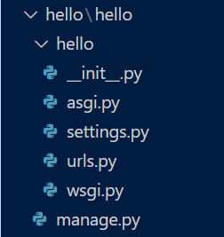

```shell
django-admin startproject hello .
```

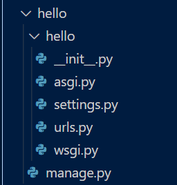

**The `.` specifies where the project should be created.**

Important initial files:

* **manage.py**
  * Is a utility module to execute various Django commands.
* **hello/settings.py**
  * Django’s configuration file.
* **hello/urls.py**
  * Main initial point of entry when someone sends a request to our Django application.

##### Manage.py: Running a Django Shell

* Django comes with a custom Python shell interface where we can do all sorts of ad-hoc testing.
* The Django shell allows you to write Python statements from the command line as though they're being executed from within the Django Web Framework.
* The Django shell is an interactive command-line interface shell environment that combines the Django framework functionality with the regular python shell.

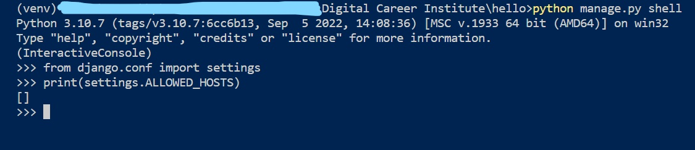

##### Manage.py: Running a Web Server

* Django comes with a web server meant to be used for development purposes.
* It is run by using Django’s command `runserver`.
* By default, the web server listens to localhost requests on port 8000, although this can be changed:

```shell
python manage.py runserver 3000
```

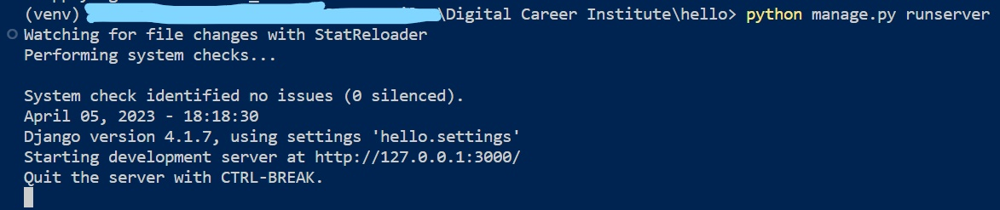

* We can also add the port to `manage.py` file by adding the following lines:

```python
from django.core.management.commands.runserver import Command as runserver

runserver.default_port = "3000"
```

We must leave this running while we work. When we want to finish, we can do it with **Ctrl + C**.

* If we go to `http://localhost:8000/` this is what we will see after running the server

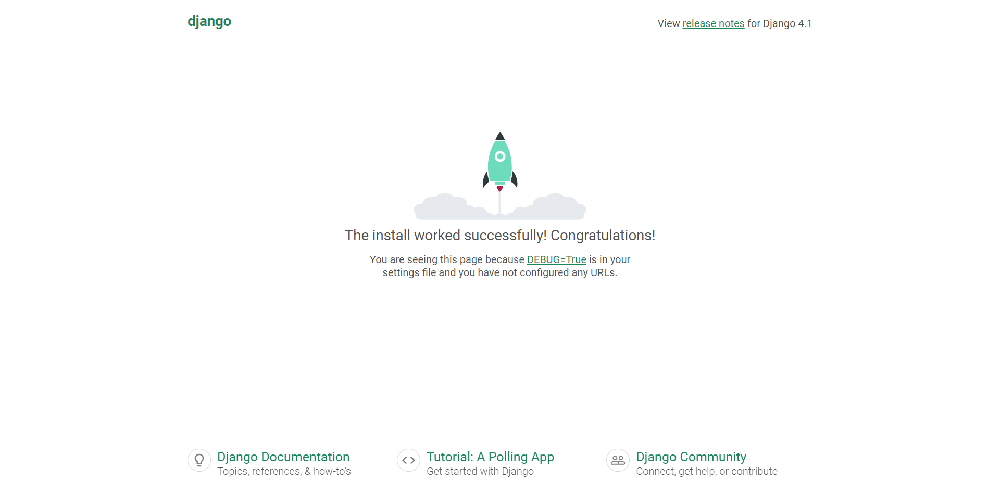

#### Django Apps

* A Django app is a component of our website that packs a set of common features (e.g a shop, a user list, a blog, etc..).

To create an app called shop we run the following command:

```shell
django-admin startapp shop
```

* This will create a directory named shop inside our main hello directory.
* Let's activate our newly created app by adding it to the `INSTALLED_APPS` in the `settings.py` file:

```python
INSTALLED_APPS = [
    # ...
    "shop.apps.ShopConfig",
]
```

##### Django Apps: Directory Tree

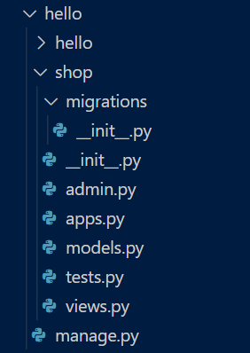

Some first important files:

* **models.py**
  * Defines the models of the app.
* **views.py**
  * Defines the views of the app.

### Recap

* How to install Django.
* How to run a development web server and access it with the browser.
* What are Django projects and apps and how to create them.
* Where are located some of the most important files of our code: models and views.
* That there is a configuration file named settings.py, and a file named urls.py that is the entry point for every request.

### URL Mapping

* URL mapping means matching a specific URL with a specific function (or class) in our code.
* We have a file views.py where we will write our different views.
* The router connects the endpoints (the HTTP points of entry in our application) with the code that will return the HTML.
* Each connection between a particular endpoint and a view is a route (or a path).
* In the project’s settings directory, the file urls.py manages the routing. 
* Let’s define a minimal view to complete a first Hello World!.

##### Django's Router: URL Dispatcher

Django’s configuration of the URL dispatcher is called URLconf and takes the form of files where paths are defined.

* In Django, the file managing the routing, by default, is called urls.py. We can find such a file in our project’s settings directory.

Add the following code to the file `hello/urls.py`:

```python
from django.contrib import admin
from django.urls import path
from shop.views import home as shop_home

urlpatterns = [
    path('admin/', admin.site.urls),
    path('shop/', shop_home)
]
```

* Paths are typically known as routes.
* A route is called a path in Django. It must contain at least two parameters: the endpoint and the view.
* Notice, the path is not tied to a domain or protocol.

##### Django's Views

A view is a function(or a class).

* All views will receive, at least, an object with the **HTTP request**.
* All views must return an **HTTP response**.

Let's create the view that we need to route to the path(route) we created earlier.
Add the following code to the file `shop/views.py`:

```python
from django.http import HttpResponse


def home(request):
    """The shop home view."""
    return HttpResponse("Hello World!")
```

* When an HTTP request is received pointing at `http://localhost:8000/shop/` Django will execute the content of the view named `home`.


##### Django's Web Router

There may be as many paths as needed in the urlpatterns sequence.
Let's add another route to the `hello/urls.py` file:

```python
# ...
from shop.views import (
    # ... 
    listing as shop_list
)

urlpatterns = [
    #...
    path('shop/browse/', shop_list),
]
```

Let's create a view for our newly created route. 
In the `shop/views.py` file add the following code after the home function:

```python
def listing(request):
    """The shop list."""
    return HttpResponse("Browse the shop")
```

* When an HTTP request is received pointing at `http://localhost:8000/shop/browse/` Django will execute the content of the view named listing.


### URLconf

#### Keyword Parameters

* If we add `<variable name>` to a path, the view will receive its value as a keyword argument with that name.

Let's add another path to the file `hello/urls.py` by adding the following code:

```python
# ...
from shop.views import (
    # ...
    item as shop_item
)

urlpatterns = [
    # ...
    path('shop/<item_id>/', shop_item),
]
```

* By using <> we can define a keyword parameter in our path. This parameter is passed onto the view(so we have to define a view that takes an argument)
* This new path will match anything starting with `shop/` followed by any character, and that string will be passed as an argument named `item_id`. 

Let's define a view for this new path by adding the following code in the file `shop/views.py`. 

```python
# ...

def item(request, item_id):
    """An item of the shop."""
    return HttpResponse(f"Looking at {item_id}")
```

* Matching examples:
  * `/shop/123/`
        
  * `/shop/anything/`
        


##### Path Collisions & Orders

When using endpoint parameters, more than one path may match the same request.

Let's reorder the code in the file `hello/urls.py`:

```python
urlpatterns = [
    # ...
    path('shop/<item_id>/', shop_item),
    path('shop/browse/', shop_list),
]
```

When an HTTP request is received pointing at `http://localhost:8000/shop/browse/` this is the output:


This happens for a few reasons:

* The endpoint shop/browse/ matches both paths.
* Django takes the first one in the sequence.
* In this case, tries to show an item called browse.

##### Parameter Types

* The type of the argument can be made explicit in the endpoint definition.
* To do this we use **path converters** and they are used to match a particular type against the received request URL.
* Django matches the path including the type.

Let's add the following code to the file `hello/urls.py`:

```python
urlpatterns = [
    # ...
    path('shop/<int:item_id>/', shop_item),
    path('shop/<str:term>/', shop_search),
]
```

* The endpoint `http://localhost:8000/shop/123/` will match both endpoints but because the `shop_item` path is first this is what will be output


* The endpoint `http://localhost:8000/shop/shirts/` should only match the last path as it is a string.


Types of Path Converters:

* str - Matches any non-empty string, excluding `/`.
* int - Matches 0 or any positive integer.
* slug - Matches ASCII letters/numbers, `-` and `_`.
* uuid - Matches a formatted UUID.
* path - Any non-empty string, including `/`.

We can also use regular expressions to match URLs against another custom format type.

##### Regular Expression Paths

Positional parameters can be defined with regular expressions.

Lets edit the file `hello/urls.py`:

* Import the `re_path` function
* Utilize `re_path` function to create a path that takes regular expressions

```python
from django.contrib import admin
from django.urls import path, re_path
from shop.views import (home as shop_home,
                        listing as shop_list,
                        item as shop_item,
                        search as shop_search,
                        )

urlpatterns = [
    path('admin/', admin.site.urls),
    path('shop/', shop_home),
    path('shop/browse/', shop_list),
    re_path('shop/(.*)/', shop_item),
    path('shop/<int:item_id>/', shop_item),
    path('shop/<str:term>/', shop_search),
]
```

* The last two paths using the `shop_item` view are similar. 
* The first one calls the view with positional arguments and the second one with keyword arguments.

Keyword parameters can also be defined with regular expressions.
For example:

```python
re_path('shop/(?P<item_id>.*)/', shop_item),
```

With regular expressions we can include the type as a matching rule, but also a custom format.
For example:

```python
urlpatterns = [
    # ...
    re_path('articles/year/([0-9]{4})/', article_list)
    # ...
]
```

* In this example, the `re_path` will only match the endpoints having a 4 digit numeric parameter.
* If it is a 3 digit or 5 digit number, for instance, it will not match the path.

##### Custom Path Converters

The previous regular expression can also be abstracted into a custom path converter.

In the `shop` directory create a file called `converters.py` and add the following code:

```python
class FourDigitConverter:
    regex = '[0-9]{4}'

    def to_python(self, value):
        """
        Tells Django how to convert the URL string into a Python value.
        """
        return int(value)

    def to_url(self, value):
        """
        Tells Django how to convert the Python value into a URL string
        """
        return '%04d' % value
```

In the file `hello/urls.py`:

* import the register_converter method from django.urls
* import the FourDigitConverter
* import the articles view as article_list
* utilize register_converter method to register the FourDigitConverter
* add path to utilize the converter and map it to the `article_list` view.

```python
from django.urls import path, register_converter
from shop.converters import FourDigitConverter
from shop.views import (home as shop_home,
                        listing as shop_list,
                        item as shop_item,
                        search as shop_search,
                        article as article_list,
                        )

register_converter(FourDigitConverter, 'yyyy')

urlpatterns = [
    # ....
    path('articles/year/<yyyy:year>/', article_list)
]
```

Let's add a view for the path we just created. In the file `shop/views.py` add the following code:

```python
# ....
def article(request, year):
    """Articles for a year."""
    return HttpResponse(f"Articles from the year {year}")
```

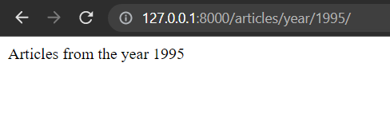

##### Path Extra Options

The path function accepts a third parameter as a dictionary with additional options to pass on to the view as keyword arguments.

Add the following paths to the file `hello/urls.py`:

```python
# ...
urlpatterns = [
    # ...
    path('articles/<int:month>/', article_list,
         {'is_int': True}),
    path('articles/<str:month>/', article_list,
         {'is_int': False})
]
```

* The view function now must be redefined to accept a keyword parameter called `is_int`.

Rewrite the `article` function in the file `shop/views.py` to look like this:

```python
def article(request, month, is_int):
    """Articles for a month."""
    if is_int:
        return HttpResponse(f"Month is an integer")
    else: 
        return HttpResponse(f"Month is a string.")
```

* The endpoint `http://localhost:8000/articles/10/` will output:
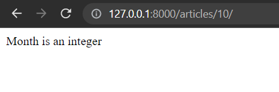

* The endpoint `http://localhost:8000/articles/October/` will output:
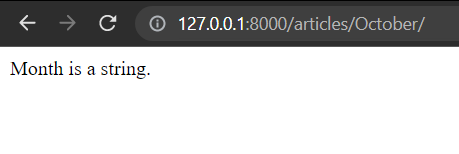

##### Naming Paths

Paths may have a name.

* Names are usually written in kebab-case.
* This will be useful when writing the links in our HTML output.

Lets add names to a few paths in the `hello/urls.py` file:

```python
urlpatterns = [
    # ...
    path('shop/', shop_home, name="shop"),
    path('shop/browse/', shop_list, name='shop-browse'),
    path('shop/<int:item_id>/', shop_item, name="shop-item"),
    # ...
]
```

##### URL Utility Functions: Reverse

The reverse function allows us to retrieve url details from `urls.py` file through the name value provided there. 

Start the shell by running the command `python manage.py shell`. Run the following lines of code:

```python
from django.urls import reverse

print(reverse('shop'))
print(reverse('shop-browse'))
print(reverse('shop-item', args=[1]))
```

This should be the output:
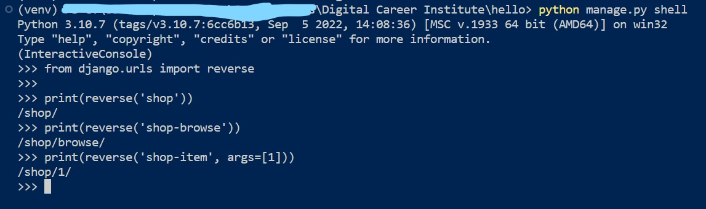

##### URL Utility Functions: Redirect

The redirect  function redirects the user to the indicated endpoint.
We can use a path name and it will be reversed automatically.

Start the shell by running the command `python manage.py shell`. Run the following lines of code:

```python
from django.shortcuts import redirect

redirect('shop')
redirect('shop-browse')
redirect('shop-item', args=[1])
```

This should be the output:
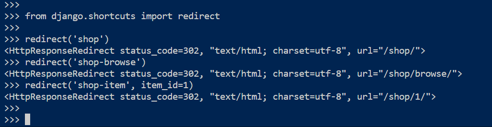

##### Path Grouping

If the project has a complex website with multiple apps and endpoints, URLs may become less manageable.
In order to make things more manageable we group paths according to their apps then include them in the project `urls.py` file.
In the `shop` directory create a file called `urls.py` and add the following code

```python
from django.urls import path
from .views import (home as shop_home,
                    listing as shop_list,
                    item as shop_item,
                    )


urlpatterns = [
    path('', shop_home, name='shop'),
    path('browse/', shop_list, name='shop-browse'),
    path('<int:item_id>/', shop_item, name='shop-item'),  
]
```

A path can be defined as a group by using include.
Modify the file `hello/urls.py` to look like this:

```python
from django.contrib import admin
from django.urls import path, include

urlpatterns = [
    path('admin/', admin.site.urls),
    path('shop/', include('shop.urls')),
]
```

* The **include()** function will load the paths defined in the file `urls.py` of the `shop` app.
* It will append the `shop/` slug to any path defined on `shop/urls.py`.

Test it out in the shell using the reverse and redirect function. 
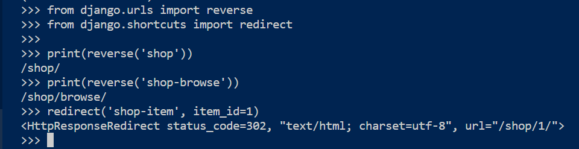

##### Path Namespacing

URL namespaces are essential URL configurations that help to avoid confusion between URL names across different apps and app instances.
Conflicting URL names may arise when you name one app URL name that is similar to another app URL name.
A solution is to use URL namespaces to uniquely identify URLs for each app in your Django project that may have similar URL configurations.

Create a new app called `blog`:

```shell
django-admin startapp blog
```

Create a `urls.py` file in the `blog` directory and add the following code to it:

```python
from django.urls import path
from .views import (home as home,
                    listing as list,
                    )

app_name = 'blog'

urlpatterns = [
    path('', home, name='home'),
    path('browse/', list, name='browse'), 
]
```

Add the following code to the `views.py` file in the `blog` directory:

```python
from django.http import HttpResponse


def home(request):
    """The shop home view."""
    return HttpResponse("Hello World!")


def listing(request):
    """The shop list."""
    return HttpResponse("Browse the shop")
```

Modify the `urls.py` file in the `shop` directory to look like this:

```python
from django.urls import path
from .views import (home as home,
                    listing as list,
                    )

app_name = 'shop'

urlpatterns = [
    path('', home, name='home'),
    path('browse/', list, name='browse'),  
]
```

In the file `hello/urls.py` file include the urls from the blog app:

```python
urlpatterns = [
    # ...
    path('blog/', include("blog.urls",namespace="blog"))
]
```

Test it out in the shell using the reverse function. 

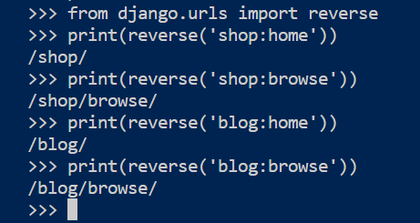

### Final Recap

* What is a Web Router and that Django’s implementation is called URL dispatcher.
* That we can configure the URL dispatcher with the URLconf, which is based in a set of files defining paths.
* How to pass parameters from the URL to the view, using the URLconf.
* How to point different parameter types in URLs to different views with the Path Converters.
* How to group and namespace app URL endpoints.