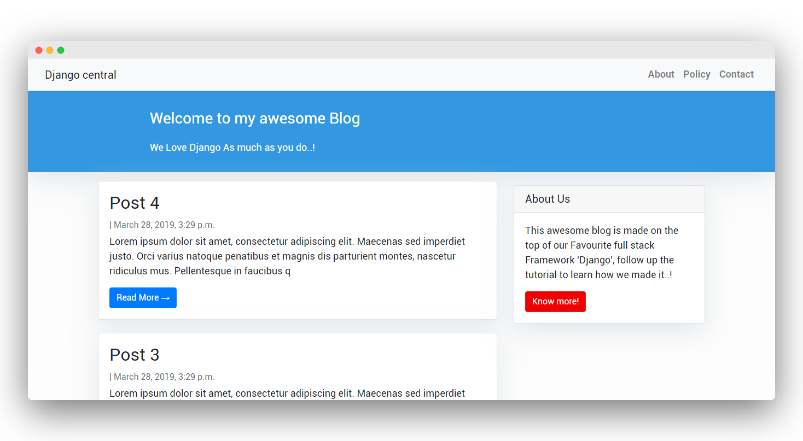

# Framework - Django

Django is a powerful Python web framework with a relatively shallow learning curve. You can easily build simple web applications in a short time. Django is also a robust and scalable framework that can be used to create large-scale web applications with complex requirements and integrations. 
We will cover how to create a simple blog application using Django to get a general idea of how the framework works, an understanding of how the different components interact with each other, and the skills to easily create Django projects with basic functionality.
The Blog application with Django that allows users to create, edit, and delete posts. The homepage will list all blog posts, and there will be a dedicated detail page for each individual post.

## Creating an isolated Python environment

1. Create an isolated environment with the following commands:

    ```shell
    mkdir mysite
    cd mysite
    python -m venv my_env
    ```

    > This will create a `my_env/` directory, including your Python environment. Any Python libraries you install while your virtual environment is active will go into the `my_env/lib/python3.8/site-packages` directory. Another advantage of using `venv` is that you won't need any administration privileges to install Python packages.

2. Run the following command to activate your virtual environment:

    ```shell
    source my_env/bin/activate
    ```

    The shell prompt will include the name of the active virtual environment enclosed in parentheses, as follows:

    ```shell
    (my_env)laptop:~ zenx$
    ```

    > You can deactivate your environment at any time with the deactivate command. You can find more information about venv at [`https://docs.python.org/3/library/venv.html`](https://docs.python.org/3/library/venv.html).

## Installing Django with pip

Django comes as a Python package and thus can be installed in any Python environment. The `pip` package management system is the preferred method for installing Django. Python 3.8+ comes with `pip` preinstalled, but you can find pip installation
instructions at [`https://pip.pypa.io/en/stable/installing/`](https://pip.pypa.io/en/stable/installing/).

1. Run the following command at the shell prompt to install Django with pip:

    ```shell
    pip install Django
    ```

    > This will install the **latest** version on Django the Python `site-packages/` directory of your virtual environment.
    > Django can be installed in several other ways. You can find a complete installation guide at [`https://docs.djangoproject.com/en/4.2/topics/install/`](https://docs.djangoproject.com/en/4.2/topics/install/).

## Creating a project

* Installing Django provides a command named `django-admin`.
* `django-admin` is a utility program that we can use to perform various operations related to Django.
* `django-admin` can be used to start a new Django project.

1. Run the following command from your shell:

    ```shell
    django-admin startproject mysite .
    ```

    This  will create a Django project with the name `mysite`. The `.` specifies where the project should be created - in this case the current working directory.

    > Avoid naming projects after built-in Python or Django modules in order to avoid conflicts.

    Let's take a look at the project structure generated:

        ├── mysite/
            ├── mysite/
            │   ├── __init__.py
            │   ├── settings.py
            │   ├── urls.py
            │   ├── wsgi.py
            ├── manage.py

    * `manage.py`: This is a command-line utility used to interact with your project. It is a thin wrapper around the django-admin.py tool. You don't need to edit this file.
    * `mysite/`: This is your project directory, which consists of the following files:
        * `__init__.py`: An empty file that tells Python to treat the mysite directory as a Python module.
        * `asgi.py`: This is the configuration to run your project as ASGI, the emerging Python standard for asynchronous web servers and applications.
        * `settings.py`: This indicates settings and configuration for your project and contains initial default settings.
        * `urls.py`: This is the place where your URL patterns live. Each URL defined here is mapped to a view.
        * `wsgi.py`: This is the configuration to run your project as a **Web Server Gateway Interface (WSGI)** application.

    **`manage.py`: Running a Django Shell**

    * Django comes with a custom Python shell interface where we can do all sorts of ad-hoc testing.
    * The Django shell allows you to write Python statements from the command line as though they're being executed from within the Django Web Framework.
    * The Django shell is an interactive command-line interface shell environment that combines the Django framework functionality with the regular python shell.

    In your terminal run the command:

    ```shell
    python manage.py shell
    ```

    It produces the following output:

    

2. Django applications contain a models.py file where data models are defined. Each data model is mapped to a database table. To complete the project setup, you need to create the tables associated with the models of the applications listed in INSTALLED_APPS. Django includes a migration system that manages this. Open the shell and run the following commands:

    ```shell
    python manage.py migrate
    ```

    By applying migrations, the tables for the initial applications are created in the database.

## Running the development server

Django comes with a lightweight web server to run your code quickly, without needing to spend time configuring a production server. When you run the
Django development server, it keeps checking for changes in your code. It reloads automatically, freeing you from manually reloading it after code changes. However, it might not notice some actions, such as adding new files to your project, so you will have to restart the server manually in these cases.

1. Start the development server by typing the following command from your project's root folder:

    ```shell
    python manage.py runserver
    ```

    You should see something like this:

    ```shell
    Watching for file changes with StatReloader
    Performing system checks...

    System check identified no issues (0 silenced).

    January 01, 2020 - 10:00:00
    Django version 3.0, using settings 'mysite.settings'
    Starting development server at http://127.0.0.1:8000/
    Quit the server with CONTROL-C.
    ```

    Now open [`http://127.0.0.1:8000/`](http://127.0.0.1:8000/) in your browser.:

    

    The preceding screenshot indicates that Django is running. If you take a look at your console, you will see the GET request performed by your browser:

    ```shell
    [01/Jan/2020 17:20:30] "GET / HTTP/1.1" 200 16351
    ```

    Each HTTP request is logged in the console by the development server. Any error that occurs while running the development server will also appear in the console.
    You can run the Django development server on a custom host and port, as follows:

    ```shell
    python manage.py runserver 127.0.0.1:8001
    ```

## Project settings

There are several settings that Django includes in this file, but these are only part of all the Django settings available. You can see all the settings and their default values at [`https://docs.djangoproject.com/en/4.2/ref/settings/`](https://docs.djangoproject.com/en/4.2/ref/settings/).

The following settings are worth looking at:

* `DEBUG` is a Boolean that turns the debug mode of the project on and off. If it is set to `True`, Django will display detailed error pages when an uncaught exception is thrown by your application. When you move to a production environment, remember that you have to set it to `False`. Never deploy a site into production with DEBUG turned on because you will expose sensitive
project-related data.
* `ALLOWED_HOSTS` is not applied while debug mode is on or when the tests are run. Once you move your site to production and set `DEBUG` to `False`, you will have to add your domain/host to this setting in order to allow it to serve your Django site.
* `INSTALLED_APPS` is a setting you will have to edit for all projects. This setting tells Django which applications are active for this site. By default, Django includes the following applications:
    * `django.contrib.admin`: An administration site
    * `django.contrib.auth`: An authentication framework
    * `django.contrib.contenttypes`: A framework for handling content types
    * `django.contrib.sessions`: A session framework
    * `django.contrib.messages`: A messaging framework
    * `django.contrib.staticfiles`: A framework for managing static files
* `MIDDLEWARE` is a list that contains middleware to be executed.
* `ROOT_URLCONF` indicates the Python module where the root URL patterns of your application are defined.
* `DATABASES` is a dictionary that contains the settings for all the databases to be used in the project. There must always be a default database. **The default configuration uses an SQLite3 database.**
* `LANGUAGE_CODE` defines the default language code for this Django site.
* `USE_TZ` tells Django to activate/deactivate timezone support. Django comes with support for timezone-aware datetime. This setting is set to True when you create a new project using the `startproject` management command.

## Projects and applications

In Django, a project is considered a Django installation with some settings. An application is a group of models, views, templates, and URLs. Applications interact with the framework to provide some specific functionalities and may be reused in various projects. You can think of a project as your website, which contains several applications, such as a blog, wiki, or forum, that can also be used by other projects.


## Creating an application

1. From the project's root directory, run the following command:

    ```shell
    python manage.py startapp blog
    ```

    This will create the basic structure of the application, which looks like this:

            └── blog/
                ├── __init__.py
                ├── admin.py
                ├── apps.py
                ├── migrations/
                │   └── __init__.py
                ├── models.py
                ├── tests.py
                └── views.py

    These files are as follows:
    * `admin.py`: This is where you register models to include them in the Django administration site—using this site is optional.
    * `apps.py`: This includes the main configuration of the blog application.
    * `migrations`: This directory will contain database migrations of your application. Migrations allow Django to track your model changes and synchronize the database accordingly.
    * `models.py`: This includes the data models of your application; all Django applications need to have a models.py file, but this file can be left empty.
    * `tests.py`: This is where you can add tests for your application.
    * `views.py`: The logic of your application goes here; each view receives an HTTP request, processes it, and returns a response.

## Activating the application

In order for Django to keep track of your application and be able to create database tables for its models, you have to activate it. To do this, edit the settings.py file and add `blog.apps.BlogConfig` to the `INSTALLED_APPS` setting. It should look like this:

```python
INSTALLED_APPS = [
    'django.contrib.admin',
    'django.contrib.auth',
    'django.contrib.contenttypes',
    'django.contrib.sessions',
    'django.contrib.messages',
    'django.contrib.staticfiles',
    'blog.apps.BlogConfig',
]
```

> The `BlogConfig` class is your application configuration. Now Django knows that your application is active for this project and will be able to load its models.

## Designing the data schema

A model is a Python class that subclasses `django.db.models.Model` in which each attribute represents a database field. Django will create a table for each model defined in the `models.py` file. When you create a model, Django will provide you with a practical API to query objects in the database easily.

1. Define a `Post` model. Add the following lines to the `models.py` file of the `blog` application:

    ```python
    from django.db import models
    from django.utils import timezone
    from django.contrib.auth.models import User


    class Post(models.Model):
        STATUS_CHOICES = (
            ('draft', 'Draft'),
            ('published', 'Published'),
        )
        title = models.CharField(max_length=250)
        slug = models.SlugField(max_length=250, unique_for_date='publish')
        author = models.ForeignKey(User, on_delete=models.CASCADE, related_name='blog_posts')
        body = models.TextField()
        publish = models.DateTimeField(default=timezone.now)
        created = models.DateTimeField(auto_now_add=True)
        updated = models.DateTimeField(auto_now=True)
        status = models.CharField(max_length=10, choices=STATUS_CHOICES, default='draft')
        
        class Meta:
            ordering = ('-publish',)

        def __str__(self):
            return self.title
    ```

    The fields are as follows:

    * `title`: This is the field for the post title. This field is `CharField`, which translates into a `VARCHAR` column in the SQL database.
    * `slug`: This is a field intended to be used in URLs. A slug is a short label that contains only letters, numbers, underscores, or hyphens. You will use the `slug` field to build beautiful, SEO-friendly URLs for your blog posts. You have added the `unique_for_date` parameter to this field so that you can build URLs for posts using their publish date and slug. Django will prevent multiple posts from having the same slug for a given date.
    * `author`: This field defines a many-to-one relationship, meaning that each post is written by a user, and a user can write any number of posts. For this field, Django will create a foreign key in the database using the primary key of the related model. In this case, you are relying on the User model of the Django authentication system. The `on_delete` parameter specifies the behavior to adopt when the referenced object is deleted. This is not specific to Django; it is an SQL standard. Using `CASCADE`, you specify that when the referenced user is deleted, the database will also delete all related blog posts. You can take a look at all the possible options at [`https://docs.djangoproject.com/en/4.2/ref/models/fields/#django.db.models.ForeignKey.on_delete`](https://docs.djangoproject.com/en/4.2/ref/models/fields/#django.db.models.ForeignKey.on_delete). You specify the name of the reverse relationship, from `User` to `Post`, with the `related_name` attribute. This will allow you to access related objects easily.
    * `body`: This is the body of the post. This field is a text field that translates into a `TEXT` column in the SQL database.
    * `publish`: This datetime indicates when the post was published. You use Django's timezone `now` method as the default value. This returns the current datetime in a timezone-aware format. You can think of it as a timezone-aware version of the standard Python `datetime.now` method.
    * `created`: This datetime indicates when the post was created. Since you are using `auto_now_add` here, the date will be saved automatically when creating an object.
    * `updated`: This datetime indicates the last time the post was updated. Since you are using `auto_now` here, the date will be updated automatically when saving an object.
    * `status`: This field shows the status of a post. You use a `choices` parameter, so the value of this field can only be set to one of the given choices.

    > You can find all field types at [`https://docs.djangoproject.com/en/4.2/ref/models/fields/`](https://docs.djangoproject.com/en/4.2/ref/models/fields/).

    The `Meta` class inside the model contains metadata. You tell Django to sort results by the `publish` field in descending order by default when you query the database. You specify the descending order using the negative prefix. By doing this, posts published recently will appear first.

    The `__str__()` method is the default human-readable representation of the object. Django will use it in many places, such as the administration site.

    You will need to create an initial migration for your Post model. In the root directory of your project, run the following command:

    ```shell
    python manage.py makemigrations blog
    ```

    You should get the following output:

    ```shell
    Migrations for 'blog':
        blog/migrations/0001_initial.py
            - Create model Post
    ```

    > Django creates a primary key automatically for each model, but you can also override this by specifying `primary_key=True` in one of your model fields. The default primary key is an id column, which consists of an integer that is incremented automatically. This column corresponds to the id field that is automatically added to your models.

    Let's sync your database with the new model. Run the following command to apply existing migrations:

    ```shell
    python manage.py migrate
    ```

    You will get an output that ends with the following line:

    ```shell
    Applying blog.0001_initial... OK
    ```

    You just applied migrations for the applications listed in INSTALLED_APPS, including your blog application. After applying the migrations, the database reflects the current status of your models. If you edit the `models.py` file in order to add, remove, or change the fields of existing models, or if you add new models, you will have to create a new migration using the `makemigrations` command. The migration will allow Django to keep track of model changes. Then, you will have to apply it with the `migrate` command to keep the database in sync with your models.

## Creating an admin site

Django comes with a built-in administration interface that is very useful for editing content. The Django site is built dynamically by reading your model metadata and providing a production-ready interface for editing content. You can use it out of the box, configuring how you want your models to be displayed in it.

The `django.contrib.admin` application is already included in the `INSTALLED_APPS` setting, so you don't need to add it.

1. Create a superuser

    You will need to create a user to manage the administration site. Run the following command:

    ```shell
    python manage.py createsuperuser
    ```

    You will see the following output; enter your desired username, email, and password, as follows:

    ```shell
    Username (leave blank to use 'admin'): admin

    Email address: admin@admin.com
    
    Password: ********
    
    Password (again): ********
    
    Superuser created successfully.
    ```

    Now start the development server with the `python manage.py runserver` command and open [`http://127.0.0.1:8000/admin/`](http://127.0.0.1:8000/admin/) in your browser. You should see the administration login page:

    

    Log in using the credentials of the user you created. You will see the administration site index page:

    

    The `Group` and `User` models that you can see in the preceding screenshot are part of the Django authentication framework located in `django.contrib.auth`. If you click on **Users**, you will see the user you created previously.

2. Add models to Admin Site

    Let's add your blog models to the administration site. Edit the `admin.py` file of the `blog` application and make it look like this:

    ```python
    from django.contrib import admin
    from .models import Post


    @admin.register(Post)
    class PostAdmin(admin.ModelAdmin):
        list_display = ('title', 'slug', 'author', 'publish', 'status',)
        prepopulated_fields = {'slug': ('title',)}
    ```

    * The `list_display` attribute allows you to set the fields of your model that you want to display on the administration object list page. The `@admin.register()` function registers the ModelAdmin class that it decorates.
    You have told Django to prepopulate the slug field with the input of the `title` field using the `prepopulated_fields` attribute.

    Now reload the administration site in your browser. You should see your Post model on the site:

    

    > When you register a model in the Django administration site, you get a user-friendly interface generated by introspecting your models that allows you to list, edit, create, and delete objects in a simple way.

    Click on the **Add** link beside Posts to add a new post. You will note the form that Django has generated dynamically for your model:

    

    Django uses different form widgets for each type of field. Even complex fields, such as the DateTimeField, are displayed with an easy interface, such as a JavaScript date picker. Fill in the form and click on the SAVE button. You should be redirected to the post list page with a success message and the post you just created:

    

## Creating model managers

There are two ways to add or customize managers for your models: you can add extra manager methods to an existing manager, or create a new manager by modifying the initial QuerySet that the manager returns. The first method provides you with a QuerySet API such as `Post.objects.my_manager()`, and the latter provides you with `Post.my_manager.all()`. The manager will allow you to retrieve posts using `Post.published.all()`.

1. Edit the models.py file of your blog application to add the custom manager:

    ```python
    class PublishedManager(models.Manager):
        def get_queryset(self):
            return super(PublishedManager, self).get_queryset().filter(status='published')


    class Post(models.Model):
        # ...
        objects = models.Manager() # The default manager.
        published = PublishedManager() # Our custom manager.
    ```

    The first manager declared in a model becomes the default manager. You can use the `Meta` attribute `default_manager_name` to specify a different default manager. If no manager is defined in the model, Django automatically creates the objects default manager for it. If you declare any managers for your model but you want to keep the objects manager as well, you have to add it explicitly to your model. In the preceding code, you add the default objects manager and the published custom manager to the Post model. The get_queryset() method of a manager returns the QuerySet that will be executed. You override this method to include your custom filter in the final QuerySet.

## Creating list and detail views

You are ready to build the views of the blog application. A Django view is just a Python function that receives a web request and returns a web response. All the logic to return the desired response goes inside the view.

First, you will create your application views, then you will define a URL pattern for each view, and finally, you will create HTML templates to render the data generated by the views. Each view will render a template, passing variables to it, and will
return an HTTP response with the rendered output.

1. Create list view

    Edit the `views.py` file of your `blog` application and make it look like this:

    ```python
    from django.shortcuts import render, get_object_or_404
    from .models import Post


    def post_list(request):
        posts = Post.published.all()
        return render(request, 'blog/post-list.html', {'posts': posts})
    ```

    You just created your first Django view. The `post_list` view takes the `request` object as the only parameter. **This parameter is required by all views.** In this view, you retrieve all the posts with the published status using the published manager that you created previously.

    Finally, you use the `render()` shortcut provided by Django to render the list of posts with the given template. **This function takes the request object, the template path, and the context variables to render the given template.** It returns an HttpResponse object with the rendered text (normally HTML code). The render() shortcut takes the request context into account, so any variable set by the template context processors is accessible by the given template. Template context processors are just callables that set variables into the context.

2. Create the Detail view

    Let's create a second view to display a single post. Add the following function to the `views.py` file:

    ```python
    def post_detail(request, year, month, day, post):
        post = get_object_or_404(Post, slug=post, status='published')
        return render(request, 'blog/post-detail.html', {'post': post})
    ```

    This is the post detail view. This view takes the `slug` and `status` arguments to retrieve a published post with the given `slug`. Note that when you created the Post model, you added the `unique_for_date` parameter to the slug field. This ensures that there will be only one post with a slug for a given date, and thus, you can retrieve single posts using the date and slug. In the detail view, you use the `get_object_or_404()` shortcut to retrieve the desired post. This function retrieves the object that matches the given parameters or an HTTP 404 (not found) exception if no object is found. Finally, you use the `render()` shortcut to render the retrieved post using a template.

## Adding URL patterns for your views

Adding URL patterns for your views URL patterns allow you to map URLs to views. A URL pattern is composed of a string pattern, a view, and, optionally, a name that allows you to name the URL project-wide. Django runs through each URL pattern and stops at the first one that matches the requested URL. Then, Django imports the view of the matching URL pattern and executes it, passing an instance of the HttpRequest class and the keyword or positional arguments.

* URL mapping means matching a specific URL with a specific view (function or class) in our code.
* We have a file views.py where we write our different views.
* The router connects the endpoints (the HTTP points of entry in our application) with the code that will return the HTML.
* Each connection between a particular endpoint and a view is a route (or a path).
* Django’s configuration of the URL dispatcher is called `URLconf` and takes the form of files where paths are defined.
* In Django, the file managing the routing, by default, is called `urls.py`. We can find such a file in our project’s settings directory.

1. Create a urls.py file in the directory of the blog application and add the following lines to it:

    ```python
    from django.urls import path
    from . import views

    app_name = 'blog'

    urlpatterns = [
        # post views
        path('', views.post_list, name='post-list'),
        path('<slug:post>/', views.post_detail, name='post-detail'),
    ]
    ```

    In the preceding code, you define an application namespace with the `app_name` variable. This allows you to organize URLs by application and use the name when referring to them. You define two different patterns using the `path()` function. The first URL pattern doesn't take any arguments and is mapped to the `post_list` view. The second pattern takes the following 1 argument and is mapped to the `post_detail` view:

    > You use angle brackets to capture the values from the URL. Any value specified in the URL pattern as `<parameter>` is captured as a string. You use path converters, such as `<int:id>`, to specifically match and return an integer and `<slug:post>` to specifically match a slug. You can see all path converters provided by Django at [`https://docs.djangoproject.com/en/4.2/topics/http/urls/#pathconverters`](https://docs.djangoproject.com/en/4.2/topics/http/urls/#pathconverters).

    If using path() and converters isn't sufficient for you, you can use re_path() instead to define complex URL patterns with Python regular expressions. You can learn more about defining URL patterns with regular expressions at [`https://docs.djangoproject.com/en/4.2/ref/urls/#django.urls.re_path`](https://docs.djangoproject.com/en/4.2/ref/urls/#django.urls.re_path). If you haven't worked with regular expressions before, you might want to take a look at the Regular Expression HOWTO located at [`https://docs.python.org/3/howto/regex.html`](https://docs.python.org/3/howto/regex.html) first.

    > **Creating a `urls.py` file for each application is the best way to make your applications reusable by other projects.**

2. Including the application URLs

    Next, you have to include the URL patterns of the `blog` application in the main URL patterns of the project.
    Edit the `urls.py` file located in the `mysite` directory of your project and make it look like the following:

    ```python
    from django.urls import path, include
    from django.contrib import admin


    urlpatterns = [
        path('admin/', admin.site.urls),
        path('blog/', include('blog.urls', namespace='blog')),
    ]
    ```

    The new URL pattern defined with `include` refers to the URL patterns defined in the `blog` application so that they are included under the `blog/` path. You include these patterns under the namespace `blog`. **Namespaces have to be unique across your entire project.** Later, you will refer to your blog URLs easily by using the namespace followed by a colon and the URL name, for example, `blog:post_list` and `blog:post_detail`. You can learn more about URL namespaces at [`https://docs.djangoproject.com/en/4.2/topics/http/urls/#url-namespaces`](https://docs.djangoproject.com/en/4.2/topics/http/urls/#url-namespaces).

## Creating Canonical URLs for models

A canonical URL is the preferred URL for a resource. You may have different pages in your site where you display posts, but there is a single URL that you use as the main URL for a blog post. The convention in Django is to add a `get_absolute_url()` method to the model that returns the canonical URL for the object.

You can use the post_detail URL that you have defined in the preceding section to build the canonical URL for Post objects. For this method, you will use the `reverse()` method, which allows you to build URLs by their name and pass optional parameters. You can learn more about the URLs utility functions at [`https://docs.djangoproject.com/en/4.2/ref/urlresolvers/`](https://docs.djangoproject.com/en/4.2/ref/urlresolvers/).

Edit the `models.py` file of the `blog` application and add the following code:

```python
from django.urls import reverse


class Post(models.Model):

# ...

def get_absolute_url(self):
    return reverse('blog:post_detail', args=[self.slug])
```

You will use the `get_absolute_url()` method in your templates to link to specific posts.

## Creating templates for your views

You have created views and URL patterns for the `blog` application. URL patterns map URLs to views, and views decide which data gets returned to the user. Templates define how the data is displayed; they are usually written in HTML in combination with the Django template language. You can find more information about the Django template language at [`https://docs.djangoproject.com/en/4.2/ref/templates/language/`](https://docs.djangoproject.com/en/4.2/ref/templates/language/).

Let's add templates to your application to display posts in a user-friendly manner.

1. Configure the templates settings first.

    Open the project's settings.py file and just below `BASE_DIR` add the route to the template directory as follows.

    ```python
    import os 

    # ....
    TEMPLATES_DIRS = os.path.join(BASE_DIR,'templates')
    ```

    In settings.py scroll to the, `TEMPLATES` which should look like this:

    ```python
    TEMPLATES = [
        {
            'BACKEND': 'django.template.backends.django.DjangoTemplates',
            'DIRS': [],
            'APP_DIRS': True,
            'OPTIONS': {
                'context_processors': [
                    'django.template.context_processors.debug',
                    'django.template.context_processors.request',
                    'django.contrib.auth.context_processors.auth',
                    'django.contrib.messages.context_processors.messages',
                ],
            },
        },
    ]

    ```

    Now add the newly created `TEMPLATES_DIRS`  in the `DIRS`:

    ```python
    TEMPLATES = [
        {
            'BACKEND': 'django.template.backends.django.DjangoTemplates',
            #  Add  'TEMPLATE_DIRS' here
            'DIRS': [TEMPLATE_DIRS],
            'APP_DIRS': True,
            'OPTIONS': {
                'context_processors': [
                    'django.template.context_processors.debug',
                    'django.template.context_processors.request',
                    'django.contrib.auth.context_processors.auth',
                    'django.contrib.messages.context_processors.messages',
                ],
            },
        },
    ]

    ```

2. Create the following directories and files inside in root directory of your project:

        ├── templates/
            ├── base.html
            └── blog/
                ├── post-detail.html
                ├── post-list.html

    The preceding structure will be the file structure for your templates. The `base.html` file will include the main HTML structure of the website and divide the content into the main content area. The `post-list.html` and `post-detail.html` files will inherit from the `base.html` file to render the blog post list and detail views, respectively.

    Django has a powerful template language that allows you to specify how data is displayed. It is based on template tags, template variables, and template filters:

    * Template tags control the rendering of the template and look like ``
    * Template variables get replaced with values when the template is rendered and look like `{{ variable }}`
    * Template filters allow you to modify variables for display and look like `{{ variable|filter }}`.

    > You can see all built-in template tags and filters at [`https://docs.djangoproject.com/en/4.2/ref/templates/builtins/`](https://docs.djangoproject.com/en/4.2/ref/templates/builtins/).

    Edit the base.html file and add the following code:

    ```html
    
    <!DOCTYPE html>
    <html>
    <head>
        <title></title>
        <link href="" rel="stylesheet">
    </head>
    <body>
        <div id="content">
            
            
        </div>
    </body>
    </html>
    ```

    `` tells Django to load the static template tags that are provided by the `django.contrib.staticfiles` application, which is contained in the `INSTALLED_APPS` setting. After loading them, you are able to use the `` template tag throughout this template. With this template tag, you can include the static files, such as the blog.css file

    There are two `` tags. These tell Django that you want to define a block in that area. Templates that inherit from this template can fill in the blocks with content. You have defined a block called title and a block called content.

    Let's edit the post-list.html file and make it look like the following:

    ```html
    

    My Blog

    
        <h1>My Blog</h1>
        
            <h2>
                <a href="{{ post.get_absolute_url }}">
                    {{ post.title }}
                </a>
            </h2>
            <p>
                Published {{ post.publish }} by {{ post.author }}
            </p>
            {{ post.body|truncatewords:30|linebreaks }}
        
    
    ```

    With the  template tag, you tell Django to inherit from the `blog/base.html` template. Then, you fill the title and content blocks of the base template with content. You iterate through the posts and display their title, date, author, and body, including a link in the title to the canonical URL of the post. In the body of the post, you apply two template filters: `truncatewords` truncates the value to the number of words specified, and `linebreaks` converts the output into HTML line breaks. You can concatenate as many template filters as you wish; each one will be applied to the output generated by the preceding one.

    Open the shell and execute the python manage.py runserver command to start the development server. Open [`http://127.0.0.1:8000/blog/`](http://127.0.0.1:8000/blog/) in your browser; you will see everything running. Note that you need to have some posts with the `Published` status to show them here.

    You should see something like this:

    
