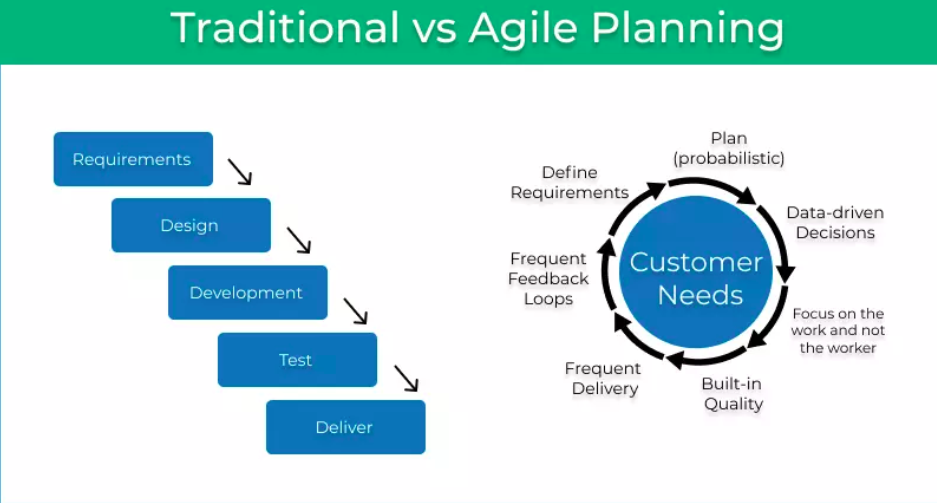
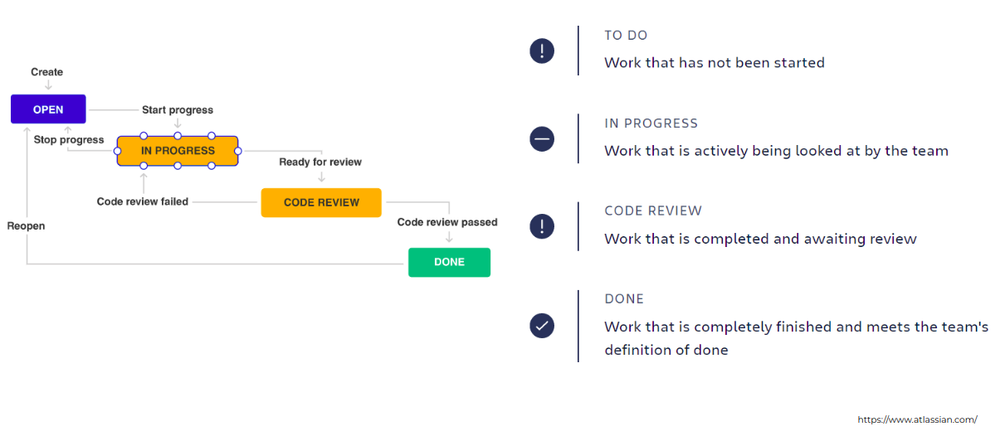

# Agile Developement

### Why is it important to talk about how to develop a project?

#### Job Postings

- https://jobs.cocus.com/en?id=930b66
- https://www.next-kraftwerke.de/job/python-backend-developer_in
- https://apply.workable.com/prestatech/j/049B3371C2/

## What is agile?

- in the last 20 years the number of companies calling themselves "Agile" increased by orders of magnitude
- The number of teams actually taking an agile approach
to their work? - Not so much.
- The term"Agile" became enormously popular.
 

### Agile's Genesis

- in the 1990s software dev was believed to be in crisis.
- software projects were overbudget, late, did not meet requirements,
- nearly one-third of them were cancelled outright.
- but agile was not the response to this. It was the response of the response

- to bring software dev under control, big organizations created highly detailed and controlled processes:
1. documentation of system requirements
2. software architects would translate these documents in a detailed design document
3. 1. programmers would translate this into code
    2. meanwhile test leads would us the same document and generate tes plans 
4. when code was done, armies of QA personal would manually test and report

These phase-based approaches are called *waterfall development* or *phase-gate development*.

### Bourn out of a Crisis
- Big companies defined their processes in excruciating detail
- everything was strictly defined and controlled
- if a project did not succeed (less than $1/6$ succeeded) more detail was added
- a massive amount of docs was the result

This was not a good way to work. It was bureaucratic and dehumanizing. Programmers felt like interchangeable cogs in an impersonal machine.

- Therefore, other methods were developed called "light weight methods"
They had names like:
- Adaptive Software Development
- Crystal
- feature-driven development
- dynamic systems development method
- extreme programming
- kanban
- and scrum

In 2001, 17 supporters of those methods met in Utah to discuss unifying their efforts. **The Agile Manifesto** was born.

### The Agile Manifesto
- actually they only agreed on the word "agile" and a statement of 4 values:
1. Individuals and interactions over processes and tools
2. Working software over comprehensive documentation
3. Customer collaboration over contract negotiation
4. Responding to change over following a plan

- but there is no unified Agile method and never will be
- agile is three things: the name, the values, and the principles https://agilemanifesto.org/principles.html

- you can't use or do agile, you can only be agile
- after all agile is philosophy. A way of thinking about software dev. 

### Adaptive rather than predictive
In Waterfall projects these definitions were used to rate a project's success:
- Success:
The project is completed on time and on-budget, with all featured and functions as originally specified.
- Challenged:
The project is completed and operational but over-budget, over the time estimate, and offers fewer features and functions than originally specified
- Impaired:
The project is canceled at some point during the development cycle.

These definitions were helpful to follow a plan.
But there is something missing:
- Even if project were a success by definition they may still fail because they did not appeal to the intended users or have a flawed business logic.
- And failures may b successful, because the system is loved by the target audience.

In contrast agile team define success differently:
- success is delivering value
- agile teams actively change their plans to increase this value

### People-oriented rather than process-oriented
- Heavyweight processes tried to prevent errors by carefully defining every aspect of software development. 
- Individual skill became less important. In theory, you could apply the same process over and over, with different people, and get the same results.

1. team work
2. how safe is it to speak up for them
3. Motivation

- agile teams also have a process. But it's in the service of the humans

### Why Agile won

- Phase-based processes are no inherently broken
- they have their flaws, but if the processes are kept slim, waterfall-style methods can work.
- the problem was the heavyweight approaches
- the process designed to prevent problems actually problems
- to predict how software will work before you use it is hard
- therefore it's critical to get working software in front of people
- get feedback and learn and respond is at the heart of Agile
- in contrast heavyweight process can take years before one can use it
- They even had a dedicted part of the process (Change Control Board) to prevent changes. ("Yes, but it will cost")
- Software was shipped that customers did not need
- agile teams make software visible (software instead of documents)
- That it's why everybody wanted Agile 

### A Typical Heavyweight Failure
- 2005, the FBI wasted $104.5 millon dollor
- a project to replace the bureau's case management software
- it started 2001 and took 4 years
- 2003 the FBI discovered that the software was unusable
- the contractor ask for another year and $56 millon
- 2004 the project was cancelled

### Why agile fails

- instead of "Let's get better results by adapting and putting people first" orga leaders start saying ".. Get me some Agile"
- companies want to have better results, more visibilty, fewer business failures
- but you can't buy agile
- what leaders can buy are the outward signs of Agile:
1. stand-up meetings
2. tools
3. stories
3. certificaion
- uncomfortable ideas like adaptive planning and people-centric are ignored

### Waterfall vs. Agile

### Agile Workeflow

### What are stories, epics, and initiatives?

- **Stories**, also called “user stories,” are short requirements or requests written from the perspective of an end user.
- **Epics** are large bodies of work that can be broken down into a number of smaller tasks (called stories).
- **Initiatives** are collections of epics that drive toward a common goal.

### User Stories
- A user story is the smallest unit of work in an agile framework. 
- User stories describe the why and the what behind the day-to-day work of development team members, often expressed as persona + need + purpose. 

### Example of epics in initiatives

Let’s say your rocket ship company wants to decrease the cost per launch by 5% this year. That’s a great fit for an initiative, as no single epic could likely achieve that big of a goal. Within that initiative, there would be epics such as, “Decrease launch-phase fuel consumption by 1%,” and “Turn all thermostats down from 71 to 69 degrees.”

### What is a Project?

- A project is defined as a sequence of tasks that must be completed to attain a certain outcome. 

- The outcome of a project results in deliverables. Anything that’s produced during the project’s development such as documents, plans, and project reports is considered a deliverable. 

- If the desired outcome is achieved on time and within budget, a project is considered to be a success.

**Boundaries**:
1. Project scope
2. Project schedule
3. People
4. Resources

### What is Project Management?
- Project management is a way to help your team track all of the work being done in order to meet a project’s requirements on time.

- Project management involves project documentation, planning, tracking, and communication

- ### Benefits of Project Management

- Keep work and goals organized in one place
- eliminate confusion and increase efficiency
- improve team effectiveness

### Project Management Process
**1. Project initiation**
- During the initiation phase, you’ll assemble your project team and identify your project scope. 
- Depending on the complexity and scale of your project, you may also want to create a project roadmap.
**2. Project planning**
- Project planning is when you outline your project requirements and define what “project success” will look like.
- This project phase is critical to successful project management—and hitting your project goals.
- During the planning stage, you’ll create your project plan, identify key milestones, and align on project costs and timeline.
**3. Project execution.**
- The bulk of your project will be the executing phase—this is the time you and your team will be working towards your project deliverables. 
- During the executing phase, you’ll want to practice workload management, time management, and task management to make sure your team is aligned, on track, and not overwhelmed.
**4. Project performance.**
- Reporting happens during and after the executing phase. 
- During the project, reporting will help you course correct, collaborate, and increase cross-functional visibility into your work.
- Then, once your project is complete, you can report on how you did, and brainstorm ideas with project stakeholders on how to improve during future projects.
**5. Project closure.**
- Once the project is done, take some time to debrief with project stakeholders in order to capture lessons learned.
- Depending on your team, you might do this as a project retrospective meeting, a project post mortem, or a project debrief.

#### Exercise
https://agilemanifesto.org/principles.html
https://agilemanifesto.org
1. how many values and principals relate to delivering valuable software and adapting feedback?
2. Which values and principals relate to putting people first?

# Self-study
- What is scrum and kanban?